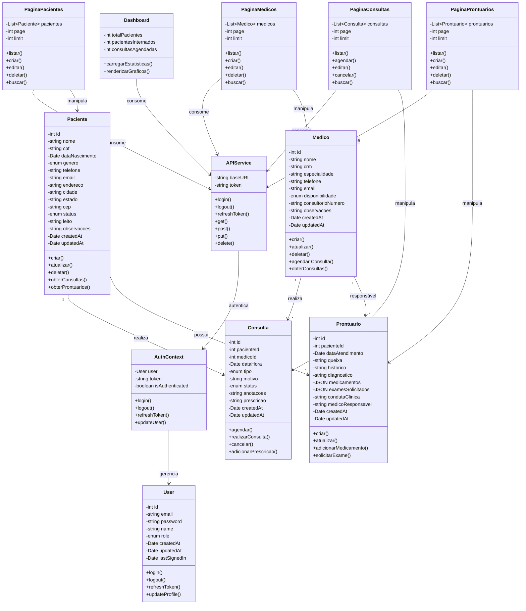
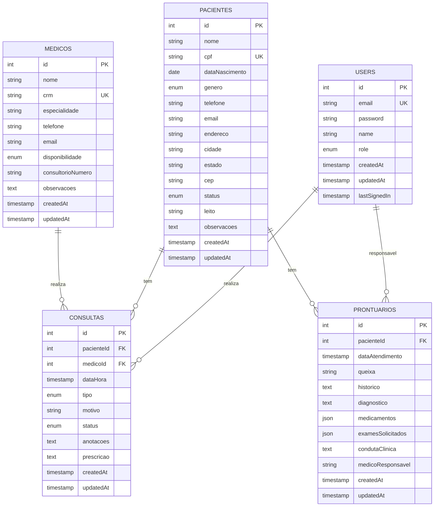
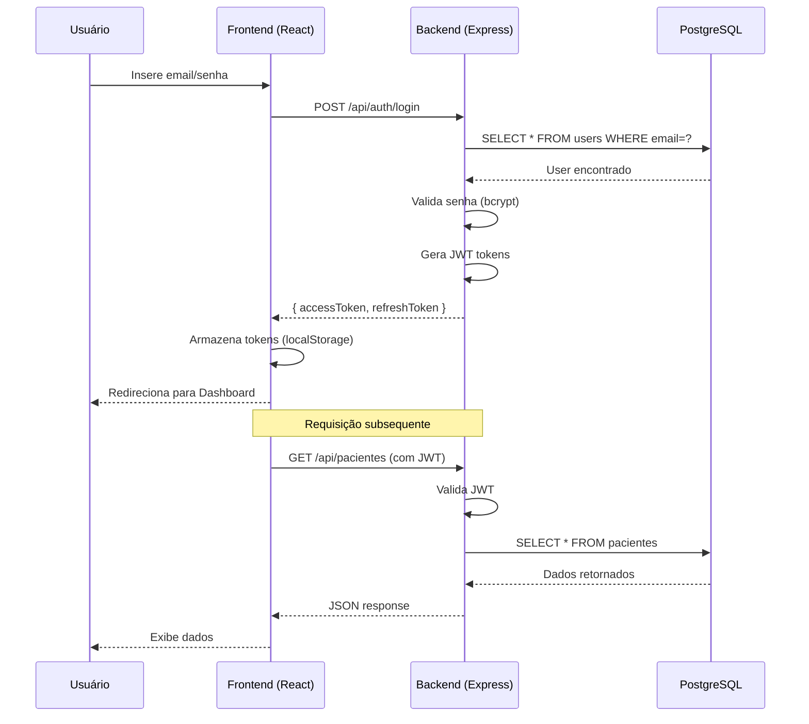
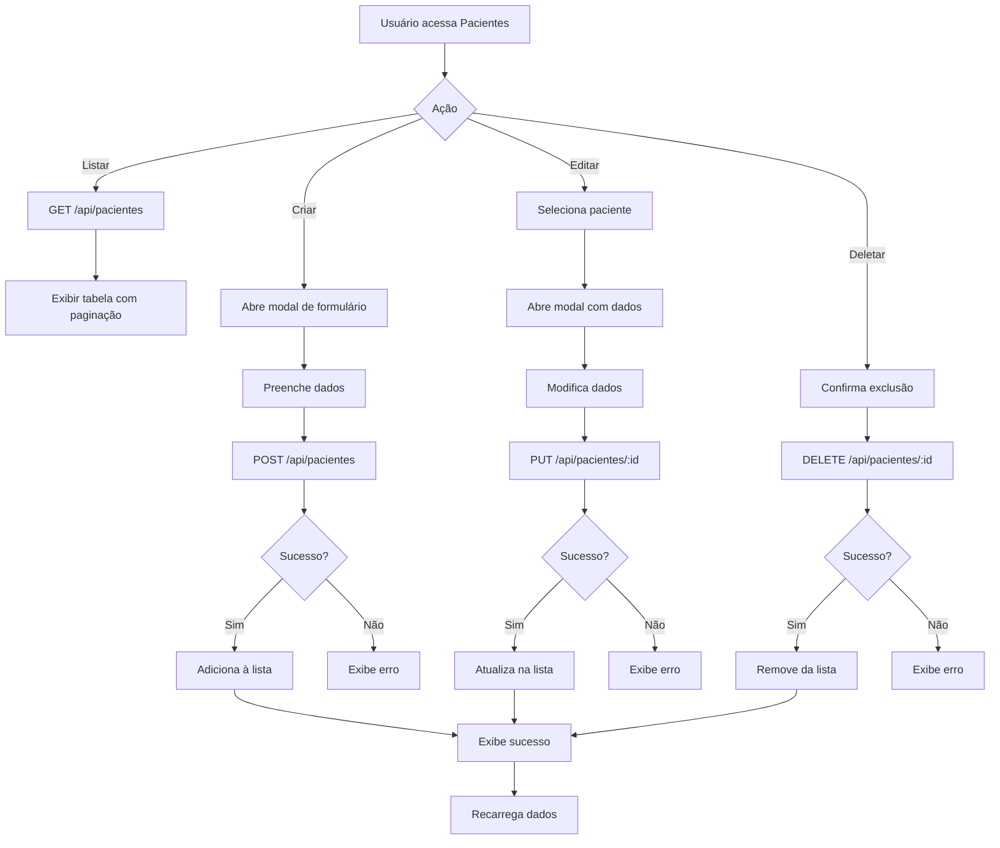
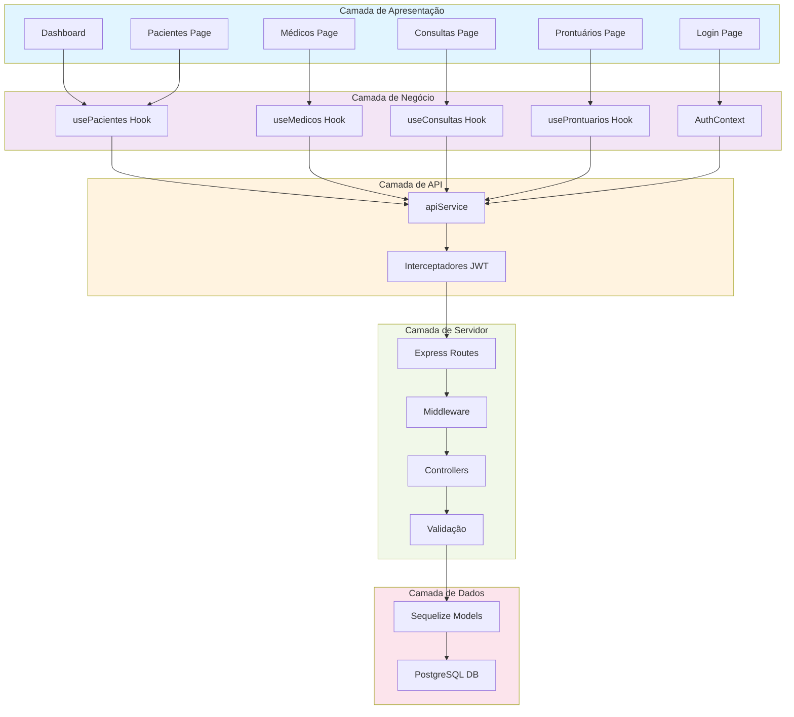
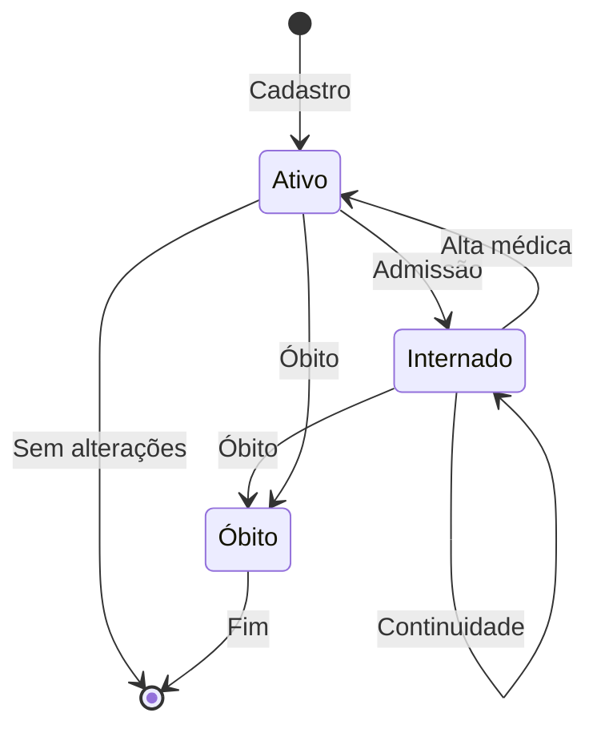
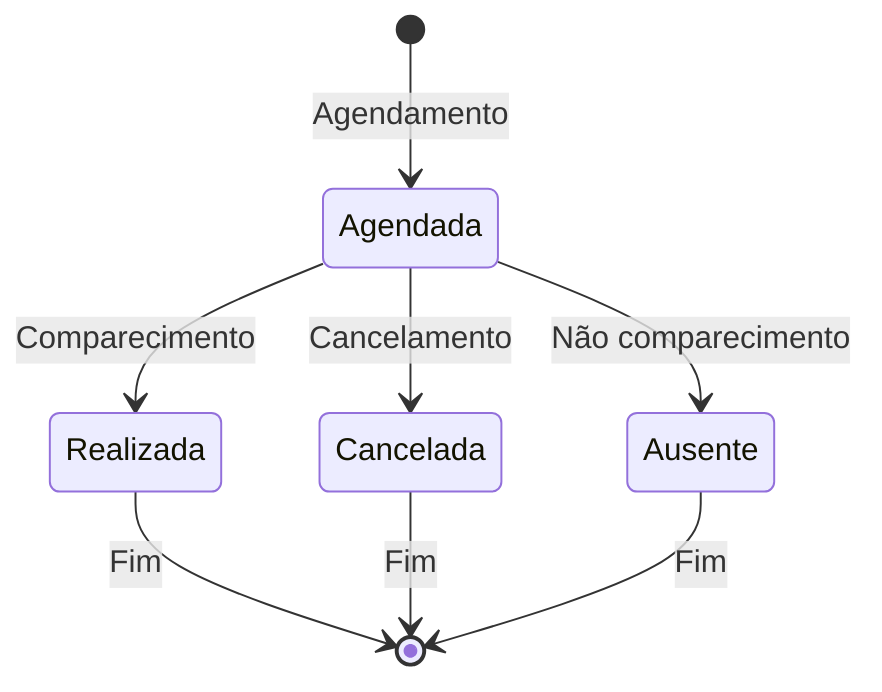
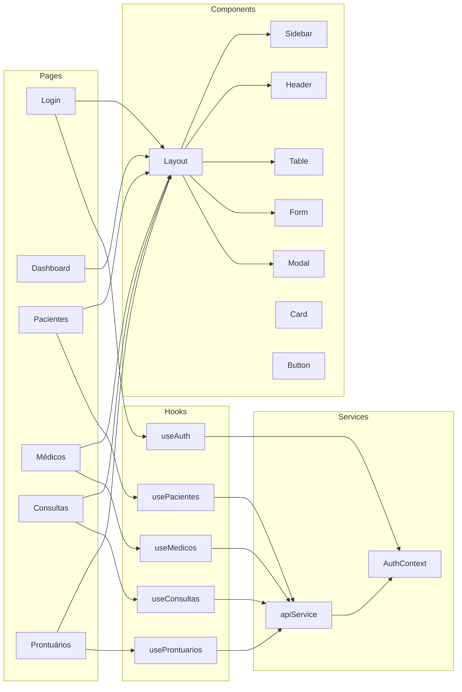
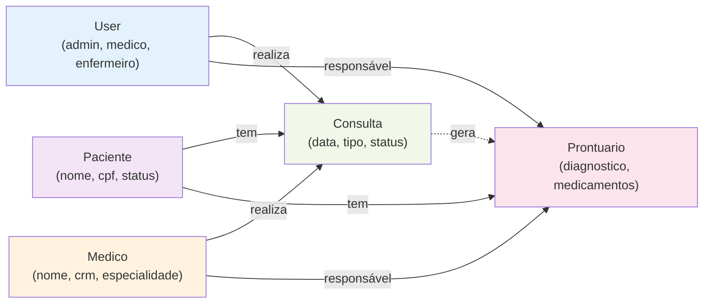

# Diagrama UML - MediCare Sistema Hospitalar

## Diagrama de Classes

---

## Diagrama de Entidade-Relacionamento (ER)

---

## Diagrama de Fluxo de Autenticação

---

## Diagrama de Fluxo CRUD - Pacientes

---

## Diagrama de Arquitetura em Camadas

---

## Diagrama de Estados - Paciente

---

## Diagrama de Estados - Consulta

---

## Diagrama de Componentes Frontend

---

## Diagrama de Endpoints REST

```mermaid
graph TB
    API["API REST - MediCare"]
    
    AUTH["🔐 Auth"]
    PACIENTES["👥 Pacientes"]
    MEDICOS["👨‍⚕️ Médicos"]
    CONSULTAS["📅 Consultas"]
    PRONTUARIOS["📋 Prontuários"]
    
    API --> AUTH
    API --> PACIENTES
    API --> MEDICOS
    API --> CONSULTAS
    API --> PRONTUARIOS
    
    AUTH --> A1["POST /login"]
    AUTH --> A2["POST /logout"]
    AUTH --> A3["POST /refresh"]
    AUTH --> A4["GET /me"]
    
    PACIENTES --> P1["GET /"]
    PACIENTES --> P2["GET /:id"]
    PACIENTES --> P3["POST /"]
    PACIENTES --> P4["PUT /:id"]
    PACIENTES --> P5["DELETE /:id"]
    
    MEDICOS --> M1["GET /"]
    MEDICOS --> M2["GET /:id"]
    MEDICOS --> M3["POST /"]
    MEDICOS --> M4["PUT /:id"]
    MEDICOS --> M5["DELETE /:id"]
    
    CONSULTAS --> C1["GET /"]
    CONSULTAS --> C2["GET /:id"]
    CONSULTAS --> C3["POST /"]
    CONSULTAS --> C4["PUT /:id"]
    CONSULTAS --> C5["DELETE /:id"]
    
    PRONTUARIOS --> PR1["GET /"]
    PRONTUARIOS --> PR2["GET /:id"]
    PRONTUARIOS --> PR3["GET /paciente/:id"]
    PRONTUARIOS --> PR4["POST /"]
    PRONTUARIOS --> PR5["PUT /:id"]
    PRONTUARIOS --> PR6["DELETE /:id"]
```

---

## Diagrama de Relacionamentos Principais

---

## Notas Importantes

### Relacionamentos

1. **User → Consulta (1:N):** Um médico realiza múltiplas consultas
2. **User → Prontuário (1:N):** Um médico é responsável por múltiplos prontuários
3. **Paciente → Consulta (1:N):** Um paciente tem múltiplas consultas
4. **Medico → Consulta (1:N):** Um médico realiza múltiplas consultas
5. **Paciente → Prontuário (1:N):** Um paciente tem múltiplos prontuários
6. **Medico → Prontuário (1:N):** Um médico é responsável por múltiplos prontuários

### Constraints

- **UNIQUE:** email (users), cpf (pacientes), crm (medicos)
- **NOT NULL:** nome, email, password (users); nome, cpf (pacientes); nome, crm (medicos)
- **FOREIGN KEY:** Integridade referencial em todos os relacionamentos
- **CHECK:** status deve estar em valores válidos (enum)

### Índices

- **PRIMARY KEY:** id em todas as tabelas
- **INDEX:** status, createdAt (para queries frequentes)
- **INDEX:** pacienteId, medicoId (para joins)

---

**Diagrama gerado:** 18 de Maio de 2026  
**Ferramenta:** Mermaid Diagram  
**Versão:** 1.0.0
